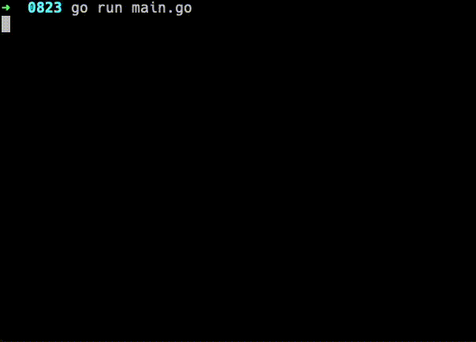

# 歡迎來到 OA's Go 語言 AWS S3 Lib

☁️ AWS S3 Lib by golang




## 說明
* 使與 Golang 製作的 [AWS S3](https://aws.amazon.com/tw/s3/) 函式。
* 單純當練習，熟悉 Golang 的編碼與 [cURL](https://pkg.go.dev/net/http) 使用方式。


## 使用

目前可以使用以下功能：

* 測試是否可以使用
* 取得資訊
* 取得 Buckets 列表
* 建立 Bucket
* 刪除 Bucket
* 取得 Bucket 內的檔案
* 上傳檔案到 Bucket 內
* 下載儲存 Bucket 內的檔案
* 刪除 Bucket 內的檔案
* 取得 Bucket 內的檔案資訊
* 複製 Bucket 內的檔案（CopyFrom）
* 複製 Bucket 內的檔案（CopyTo）
* 清空 Bucket 內所有的檔案

## 功能範例

### 測試是否可以使用

``` go
package main

import (
  "fmt"
  s3Lib "github.com/oawu/Golang-S3"
)

func main() {
  s3 := s3Lib.Instance("access Key", "secret Key")
  if s3.Test() {
    fmt.Println("測試成功")
  } else {
    fmt.Println("測試失敗")
  }
}
```

### 取得資訊

``` go
package main

import (
  "fmt"
  s3Lib "github.com/oawu/Golang-S3"
)

func main() {
  s3 := s3Lib.Instance("access Key", "secret Key")
  info, err := s3.Info()
  if err != nil {
    fmt.Printf("無法取得資訊，錯誤訊息：%s\n", err)
    return
  }
  fmt.Printf("  Owner.Id：%s\n", info.Owner.Id)
  fmt.Printf("  Owner.Name：%s\n", info.Owner.Name)
  fmt.Printf("  Buckets Length：%d\n", len(info.Buckets))
}
```

### 取得 Buckets 列表

``` go
package main

import (
  "fmt"
  s3Lib "github.com/oawu/Golang-S3"
)

func main() {
  s3 := s3Lib.Instance("access Key", "secret Key")
  buckets, err := s3.Buckets()
  if err != nil {
    fmt.Printf("無法取得 Buckets 列表，錯誤訊息：%s\n", err)
    return
  } 
  fmt.Printf("  共有 %d 個 Buckets\n", len(buckets))
  for _, bucket := range buckets {
    fmt.Printf("    %s\n", bucket)
  }
}
```

### 建立 Bucket

``` go
package main

import (
  "fmt"
  s3Lib "github.com/oawu/Golang-S3"
)

func main() {
  s3 := s3Lib.Instance("access Key", "secret Key")
  err := s3.Bucket("your_bucket_name").Create()
  if err != nil {
    fmt.Printf("無法建立 Buckets，錯誤訊息：%s\n", err)
    return
  }
  fmt.Println("成功")
}
```

可帶條件，如區域與權限，以下為設置此 Bucket 區域為東京，並且為公開。

``` go
  import (
    s3Enum "github.com/oawu/Golang-S3/enum"
  )
  err := s3.Bucket("your_bucket_name").Create(s3Enum.ACL_PUBLIC_READ, s3Enum.LOC_AP_NORTHEAST_1)
```

### 刪除 Bucket

``` go
package main

import (
  "fmt"
  s3Lib "github.com/oawu/Golang-S3"
)

func main() {
  s3 := s3Lib.Instance("access Key", "secret Key")
  err := s3.Bucket("your_bucket_name").Delete()
  if err != nil {
    fmt.Printf("無法刪除 Buckets，錯誤訊息：%s\n", err)
    return
  }
  fmt.Println("成功")
}
```

### 取得 Bucket 內的檔案

``` go
package main

import (
  "fmt"
  s3Lib "github.com/oawu/Golang-S3"
)

func main() {
  s3 := s3Lib.Instance("access Key", "secret Key")
  files, err := s3.Bucket("your_bucket_name").Files()
  if err != nil {
    fmt.Printf("取得 Bucket 內的檔案失敗，錯誤訊息：%s\n", err)
    return
  }

  fmt.Printf("  全部共有 %d 個檔案\n", len(files))
  for _, file := range files {
    fmt.Printf("    Key（path）：%s\n", file.Key)
    fmt.Printf("    Time（unix）：%d\n", file.Time)
    fmt.Printf("    ETag（md5）：%s\n", file.Md5)
    fmt.Printf("    Size（byte）：%d\n", file.Size)
    fmt.Println()
  }
}
```

可帶條件，如 前綴（Prefix）、路徑之後（NextKey）、排除（Exclude）、長度（Limit），如下範例為前綴 `test/` 內取得前 10 筆資料。

``` go
  import (
    s3Enum "github.com/oawu/Golang-S3/enum"
  )
  files, err := s3.Bucket("your_bucket_name").Files(s3Lib.Where{
    Prefix: "test/",
    Limit: 10,
  })
```

### 上傳檔案到 Bucket 內

``` go
package main

import (
  "fmt"
  s3Lib "github.com/oawu/Golang-S3"
)

func main() {
  s3 := s3Lib.Instance("access Key", "secret Key")
  err := s3.Bucket("your_bucket_name/filepath/file.ext").Put("/local/filepath/file.ext")
  if err != nil {
    fmt.Printf("上傳失敗，錯誤訊息：%s\n", err)
    return
  }

  fmt.Println("上傳成功")
}
```

可帶條件，如權限或快取時間，以下為設置此檔案上傳後為公開的，並且暫存 1 分鐘。

``` go
  import (
    s3Enum "github.com/oawu/Golang-S3/enum"
  )
  err := s3.Bucket("your_bucket_name/filepath/file.ext").Put("/local/filepath/file.ext", enum.ACL_PUBLIC_READ, 60)
```

### 下載儲存 Bucket 內的檔案

``` go
package main

import (
  "fmt"
  s3Lib "github.com/oawu/Golang-S3"
)

func main() {
  s3 := s3Lib.Instance("access Key", "secret Key")
  err := s3.Bucket("your_bucket_name/filepath/file.ext").Save("/local/filepath/file.ext")
  if err != nil {
    fmt.Printf("儲存失敗，錯誤訊息：%s\n", err)
    return
  }

  fmt.Println("儲存成功")
}
```

可帶參數，決定下載後檔案的權限，預設為 `0644`，如下範例圍設置 `0777`

``` go
  err := s3.Bucket("your_bucket_name/filepath/file.ext").Save("/local/filepath/file.ext", 0777)
```

### 刪除 Bucket 內的檔案

``` go
package main

import (
  "fmt"
  s3Lib "github.com/oawu/Golang-S3"
)

func main() {
  s3 := s3Lib.Instance("access Key", "secret Key")
  err := s3.Bucket("your_bucket_name/filepath/file.ext").Del()
  if err != nil {
    fmt.Printf("刪除失敗，錯誤訊息：%s\n", err)
    return
  }

  fmt.Println("刪除成功")
}
```

### 取得 Bucket 內的檔案資訊

``` go
package main

import (
  "fmt"
  s3Lib "github.com/oawu/Golang-S3"
)

func main() {
  s3 := s3Lib.Instance("access Key", "secret Key")
  meta, err := s3.Bucket("your_bucket_name/filepath/file.ext").Meta()
  if err != nil {
    fmt.Printf("取得失敗，錯誤訊息：%s\n", err)
    return
  }

  fmt.Printf("  ContentLength：%d\n", meta.ContentLength)
  fmt.Printf("  Time（unix）：%d\n", meta.Time)
  fmt.Printf("  ETag（md5）：%s\n", meta.Md5)
  fmt.Printf("  ContentType：%s\n", meta.ContentType)
}
```

### 複製 Bucket 內的檔案（CopyFrom）

``` go
package main

import (
  "fmt"
  s3Lib "github.com/oawu/Golang-S3"
)

func main() {
  s3 := s3Lib.Instance("access Key", "secret Key")
  err := s3.Bucket("your_bucket_name/filepath/destination_file.ext").CopyFrom("your_bucket_name/filepath/source_file.ext")
  if err != nil {
    fmt.Printf("複製失敗，錯誤訊息：%s\n", err)
    return
  }

  fmt.Println("複製完成")
}
```

可帶條件，如權限或快取時間，以下為設置此新的檔案為公開的，並且暫存 1 分鐘。

``` go
  import (
    s3Enum "github.com/oawu/Golang-S3/enum"
  )
  err := s3.Bucket("your_bucket_name/filepath/destination_file.ext").CopyFrom("your_bucket_name/filepath/source_file.ext", enum.ACL_PUBLIC_READ, 60)
```

### 複製 Bucket 內的檔案（CopyTo）

``` go
package main

import (
  "fmt"
  s3Lib "github.com/oawu/Golang-S3"
)

func main() {
  s3 := s3Lib.Instance("access Key", "secret Key")
  err := s3.Bucket("your_bucket_name/filepath/source_file.ext").CopyTo("your_bucket_name/filepath/destination_file.ext")
  if err != nil {
    fmt.Printf("複製失敗，錯誤訊息：%s\n", err)
    return
  }

  fmt.Println("複製完成")
}
```

可帶條件，如權限或快取時間，以下為設置此新的檔案為公開的，並且暫存 1 分鐘。

``` go
  import (
    s3Enum "github.com/oawu/Golang-S3/enum"
  )
  err := s3.Bucket("your_bucket_name/filepath/source_file.ext").CopyTo("your_bucket_name/filepath/destination_file.ext", enum.ACL_PUBLIC_READ, 60)
```

### 清空 Bucket 內所有的檔案

``` go
package main

import (
  "fmt"
  s3Lib "github.com/oawu/Golang-S3"
)

func main() {
  s3 := s3Lib.Instance("access Key", "secret Key")
  errs := s3.Bucket("your_bucket_name").Clean()
  if len(errs) > 0 {
    fmt.Println("清空失敗，錯誤訊息：\n")
    for _, err := range errs {
      fmt.Printf("  %s\n", err)
    }
    return
  }

  fmt.Println("清空完成")
}
```